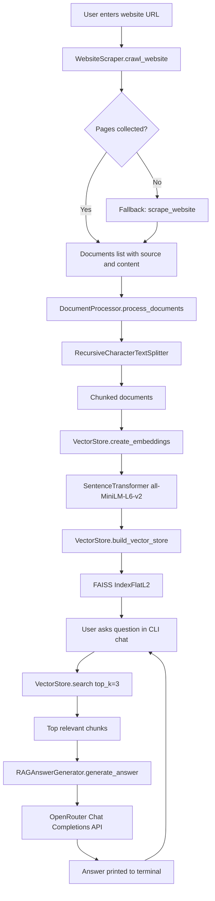

# SmartSite Assistant

SmartSite Assistant is an RAG-based AI-powered system that converts any website into an interactive knowledge base. By providing a website URL, the system crawls relevant pages, extracts both structured and unstructured content, and enables users to ask natural language questions about the website.

The project implements a Retrieval-Augmented Generation (RAG) pipeline to retrieve relevant information from the website and generate accurate responses grounded in the site's content while ensuring minimal latency.

## What This Project Does

- Crawls website pages (with fallback single-page scraping)
- Splits raw content into semantic chunks
- Builds embeddings using `all-MiniLM-L6-v2`
- Stores embeddings in a FAISS index for similarity search
- Retrieves top relevant chunks for each question
- Generates grounded answers with OpenRouter chat completions

## Project Architecture

### Vertical Flow (GitHub Mermaid)



## Repository Structure

```text
A/
  document_processor.py      # chunking and preprocessing
  scrapper.py                # website crawling/scraping with Firecrawl
  vector_store.py            # embeddings + FAISS index + semantic search
  rag_answer_generator.py    # answer generation via OpenRouter
  test.py                    # main CLI chat loop (entry point)
  requirement.txt            # Python dependencies
  README.md
```

## Tech Stack

- Python
- Firecrawl (`firecrawl-py`)
- LangChain text splitters
- Sentence Transformers
- FAISS (`faiss-cpu`)
- OpenRouter API
- Requests / NumPy / python-dotenv

## Setup

### 1) Clone and enter project

```bash
git clone <your-repo-url>
cd A
```

### 2) Create and activate virtual environment

```bash
python -m venv venv
```

Windows (PowerShell):

```powershell
.\venv\Scripts\Activate.ps1
```

### 3) Install dependencies

```bash
pip install -r requirement.txt
```

### 4) Create `.env`

Add the following keys:

```env
FIRECRAWL_API_KEY=your_firecrawl_api_key
OPENROUTER_API_KEY=your_openrouter_api_key
OPENROUTER_MODEL=openrouter/auto
```

`OPENROUTER_MODEL` is optional and defaults to `openrouter/auto`.

## Run

```bash
python test.py
```

Then:

1. Enter a website URL.
2. Wait for crawling + vector index creation.
3. Ask questions in the terminal chat loop.
4. Type `exit` or `quit` to stop.

## Core Pipeline by File

- `scrapper.py`
  - `crawl_website(url)`: crawls multiple pages (default limit: 5)
  - `scrape_website(url)`: fallback single-page scrape
- `document_processor.py`
  - `process_documents(...)`: splits content into chunks
- `vector_store.py`
  - `build_vector_store(...)`: builds FAISS index from embeddings
  - `search(query, top_k=3)`: retrieves nearest chunks
- `rag_answer_generator.py`
  - `generate_answer(question, retrieved_docs)`: prompts OpenRouter model
- `test.py`
  - wires all components into an interactive Q&A loop

## Example Usage

```text
Enter website URL: https://example.com

Ask a question about the website: What services are offered?
Answer:
...generated response grounded in retrieved website chunks...
```

## Notes

- Current interface is terminal-based (CLI chat loop).
- Retrieved context is truncated per chunk before prompting to keep requests efficient.
- If crawl fails, scraper attempts a single-page fallback automatically.

## Future Improvements

- Add Streamlit web UI for a visual chat interface
- Persist FAISS index to disk for reuse between sessions
- Add source citation display in answers
- Add unit/integration tests for each pipeline stage

